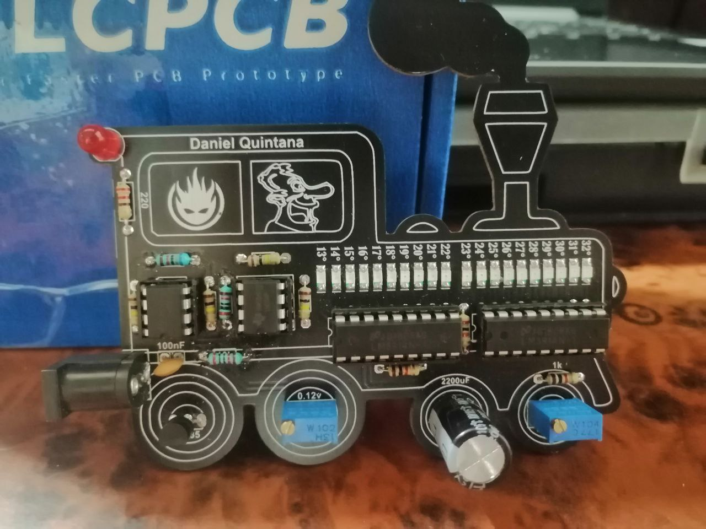
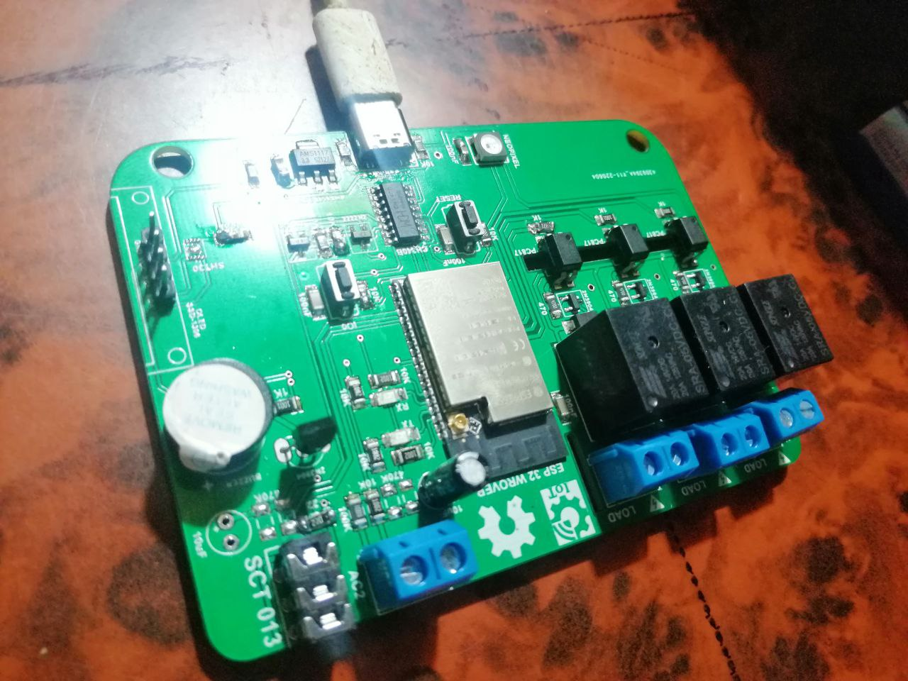
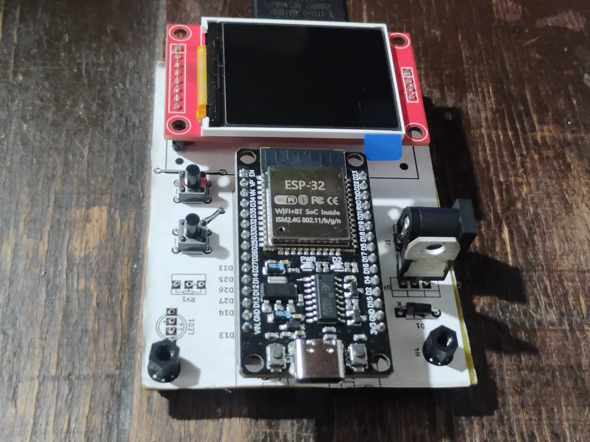
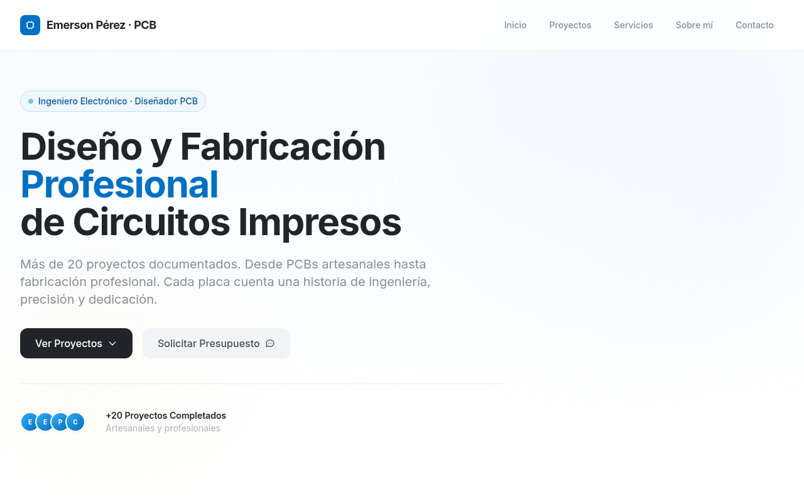

# 👋 Hola, soy Emerson Aldair Pérez Rivera

  
  

💡 Apasionado por el **Internet de las Cosas (IoT)**, microcontroladores y el desarrollo de soluciones conectadas a la nube. Me especializo en integrar **hardware + software** para crear proyectos funcionales y robustos del mundo real.

---

## 🧠 Sobre mí

- 🔌 **Firmware & Hardware:** Experiencia desarrollando con **ESP32 (ESP-IDF / Arduino)** y microcontroladores AVR/ARM.
- ☁️ **Cloud & Backend:** Integración de dispositivos con **Firebase** y servicios en tiempo real, además de backend con **Django**.
- 🐧 **Entorno:** Usuario diario de **Linux** enfocado en la automatización, personalización y eficiencia del entorno de desarrollo.
- 🌐 **Redes & Servidores:** Configuración e implementación de servicios esenciales (DHCP, DNS, servidores de archivos).
- 🧪 Interés constante en la optimización de firmware, bajo consumo, sensores avanzados y diseño de hardware escalable.

---

## 🛠️ Tecnologías y Herramientas

| Categoría | Tecnologías |
| :--- | :--- |
| **Lenguajes** | `C` · `C++` · `Python` · `SQL` · `Bash` |
| **IoT & Hardware** | `ESP32` · `ESP-IDF` · `FreeRTOS` · `Arduino` · `PlatformIO` |
| **Software & BD** | `Django` · `PostgreSQL` · `Firebase` |
| **Entornos & Herramientas** | `Linux (Arch/Ubuntu)` · `Git` · `Docker` · `Neovim` · `VS Code` |
| **Diseño de PCB** | `KiCad` · `Altium Designer` · `EasyEDA` |

---

## 🚀 Proyectos Destacados

### 🔹 [ESP32 Trainer](https://github.com/EmersonEE/ESP32_Trainer)
> Plataforma de prácticas orientada al aprendizaje de periféricos, manejo de interrupciones, comunicación y control en entornos ESP32. Desarrollado buscando buenas prácticas de firmware.

### 🔹 [IoT + Firebase](https://github.com/EmersonEE/IoT_Project)
> Sistema de control y monitoreo de dispositivos embebidos mediante base de datos NoSQL en la nube en tiempo real. Enfoque en baja latencia y sincronización de estado.

### 🔹 [Sistemas de Red en Ubuntu Server](https://github.com/EmersonEE)
> Implementación y despliegue de infraestructura de red local: configuración de servidores DHCP, DNS internos, almacenamiento compartido con Samba y servicios empresariales seguros.

### 🔹 [Brazo Seleccionador FPGA](https://github.com/EmersonEE/Brazo-Seleccionador-FPGA.git)
> Diseño y lógica de control para un brazo automatizado encargado de la clasificación de objetos por tamaño, implementado mediante descripción de hardware.

---

## 🧩 PCBs Diseñadas

Fascinado por llevar los diagramas del papel al silicio. Aquí algunos de mis diseños de hardware recientes:

  
  
  

---

## 🌐 Mi Página Web

Visita mi galería de PCBs y proyectos en línea:

  

  

---

## 🌱 Actualmente Aprendiendo

- Desarrollo profesional y avanzado utilizando **ESP-IDF** nativo.
- Patrones de arquitectura de software aplicados a sistemas embebidos e IoT masivo.
- Técnicas avanzadas de ruteo de PCBs de alta velocidad y compatibilidad electromagnética (EMC).

---

## 📫 Contacto & Redes

Estoy abierto a colaboraciones en proyectos de hardware, firmware o desarrollo de software. ¡Hablemos!

  
  

⭐️ *¡Gracias por visitar mi perfil! Siempre construyendo el siguiente firmware.*
